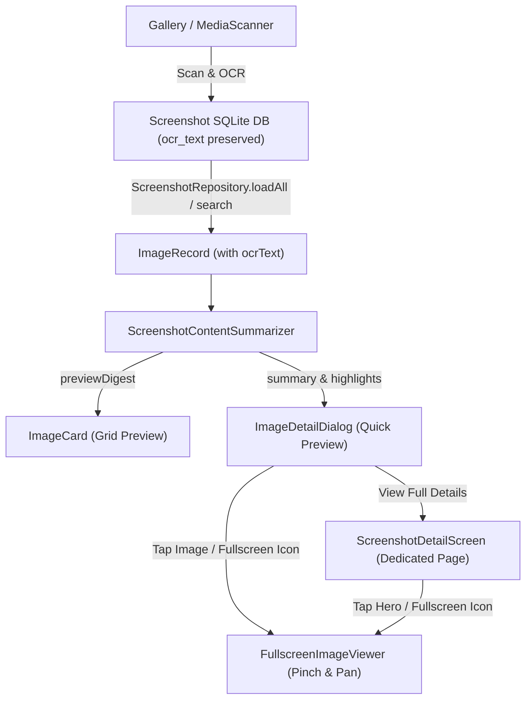

# Enhanced Screenshot Details Design Specification

**Date:** 2026-09-28  
**Status:** Approved  
**Author:** Antigravity & User  

---

## 1. Overview & Goals

This specification defines the architecture, data models, content summarization engine, and UI workflows to enhance screenshot details within the Image Categorizer application.

### Key Capabilities
1. **Preview Summarization**: Generate clean, distilled 1–2 line content digests and highlights from extracted OCR text for grid cards and quick preview dialogs.
2. **Dedicated Full Detail Screen**: A complete screen navigated from the quick detail dialog, offering copyable full OCR text, detected key attributes, category switching, and rich metadata.
3. **Fullscreen Zoomable Image Viewer**: An immersive viewer supporting pinch-to-zoom (1x–5x), two-dimensional panning, double-tap zoom/reset, and seamless high-resolution loading.

---

## 2. Architecture & Data Flow



---

## 3. Data Model & Summarization Engine

### 3.1 Model Updates
In [`ImageRecord`](file:///Users/user/Desktop/AGY_GLOBAL/image-categorizer/shared/src/commonMain/kotlin/com/mrturingdev/ssclassify/model/Models.kt):
```kotlin
data class ImageRecord(
    val id: String,
    val name: String,
    val folder: String,
    val relativePath: String,
    val width: Long,
    val height: Long,
    val dateMillis: Long,
    val category: ImageCategory,
    val subCategory: String? = null,
    val description: String? = null,
    val autoCategory: ImageCategory = category,
    val source: CategorySource = CategorySource.Rules,
    val ocrText: String = "",
)
```
In [`ScreenshotRepository.kt`](file:///Users/user/Desktop/AGY_GLOBAL/image-categorizer/shared/src/commonMain/kotlin/com/mrturingdev/ssclassify/data/ScreenshotRepository.kt):
Pass `ocr_text` from the SQLite row into `ImageRecord.ocrText`.

### 3.2 Content Summarizer (`ScreenshotContentSummarizer`)
Located in `shared/src/commonMain/kotlin/com/mrturingdev/ssclassify/classify/ScreenshotContentSummarizer.kt`:
* **Input**: `ocrText: String`, `name: String`, `subCategory: String?`.
* **Outputs**:
  * `summaryDigest: String`: 1–2 line concise summary. Strips status-bar clutter (time patterns like `12:45`, battery percentages, lonely symbols). Identifies primary headline or narrative sentences. Truncates cleanly to ~100 characters.
  * `highlights: List<Pair<String, String>>`: Extracted key entity pairs:
    * **Amount / Total**: Matches currency patterns (e.g. `Total: $XX.XX`, `NPR XX`, `Rs. XX`).
    * **Date / Time**: Matches common date stamps.
    * **Reference / ID**: Matches order IDs, invoice numbers, PNRs, or transaction codes.
    * **Sender / App**: Identifies message sender lines or application names.
  * `cleanFullText: String`: Cleaned, nicely spaced full transcript for easy reading.

### 3.3 High-Resolution Thumbnail Loading
In [`ThumbnailLoader.android.kt`](file:///Users/user/Desktop/AGY_GLOBAL/image-categorizer/shared/src/androidMain/kotlin/com/mrturingdev/ssclassify/data/ThumbnailLoader.android.kt) & [`ThumbnailLoader.ios.kt`](file:///Users/user/Desktop/AGY_GLOBAL/image-categorizer/shared/src/iosMain/kotlin/com/mrturingdev/ssclassify/data/ThumbnailLoader.ios.kt):
* Key cache by `"$id@$sizePx"`.
* Support high-resolution request (`sizePx = 2048` or `0` for uncapped) for fullscreen and detail view.

---

## 4. UI Components & Screen Flow

### 4.1 Grid Item: `ImageCard`
* Displays image thumbnail.
* Shows subcategory badge.
* Shows `ScreenshotContentSummarizer.summarize(image.ocrText, image.description)` in the bottom gradient scrim (max 2 lines, ellipsis).

### 4.2 Quick Preview: `ImageDetailDialog`
* Triggered by tapping an `ImageCard`.
* Top section: Scaled image preview with a floating **Fullscreen Button** (`Icons.Rounded.Fullscreen`). Tapping the image or the button opens `FullscreenImageViewer`.
* Title & category picker pill.
* Extracted **Summary Card** highlighting the digest and key entities (e.g. Total amount or Date).
* Action Row:
  * **"Done"** dismiss button.
  * **"View Full Details"** button navigating to `ScreenshotDetailScreen`.

### 4.3 Dedicated Details Page: `ScreenshotDetailScreen`
* Top App Bar with back navigation arrow and category pill.
* Scrollable layout:
  1. **Hero Image Banner**: Large card; tapping opens fullscreen view.
  2. **Category Management**: Category pill dropdown allowing category correction/reversion.
  3. **Metadata Section**: Resolution (`width × height px`), Date & Time captured/scanned, Folder, and File Name.
  4. **Key Highlights Card**: Chip or table layout of detected entities (Amount, Date, IDs).
  5. **Complete OCR Text Card**: Full scrollable transcript, monospace/clean typography, with a **"Copy Text"** action providing clipboard copy and temporary visual confirmation.

### 4.4 Fullscreen Viewer: `FullscreenImageViewer`
* Full-screen dialog/overlay with dark canvas (`Color.Black`).
* Gestures:
  * Pinch-to-zoom from `1.0f` up to `5.0f`.
  * Two-dimensional pan when zoomed in, with boundary clamping.
  * Double-tap gesture: toggles between `1.0f` and `2.5f` zoom at the tapped center.
* Top Bar: Close icon button (`Icons.Rounded.Close`), image title.
* Bottom Overlay: Subtle usage hint ("Pinch to zoom • Double-tap to expand").
* First displays the already-cached preview, upgrading to 2048px high-resolution as soon as decoded.

---

## 5. Testing & Verification Plan

1. **Unit Tests**:
   * Add `ScreenshotContentSummarizerTest` covering:
     * Extraction of clean 1-2 line digests from varied OCR texts (receipts, flights, chat, code).
     * Detection of amounts, dates, and reference numbers.
     * Graceful fallback when OCR text is empty.
   * Verify all existing repository, learner, and categorizer tests pass.
2. **Build Verification**:
   * Run `./gradlew :shared:testDebugUnitTest` to verify test suite passes.
   * Run `./gradlew :androidApp:assembleDebug` to verify Android packaging and UI compilation.
